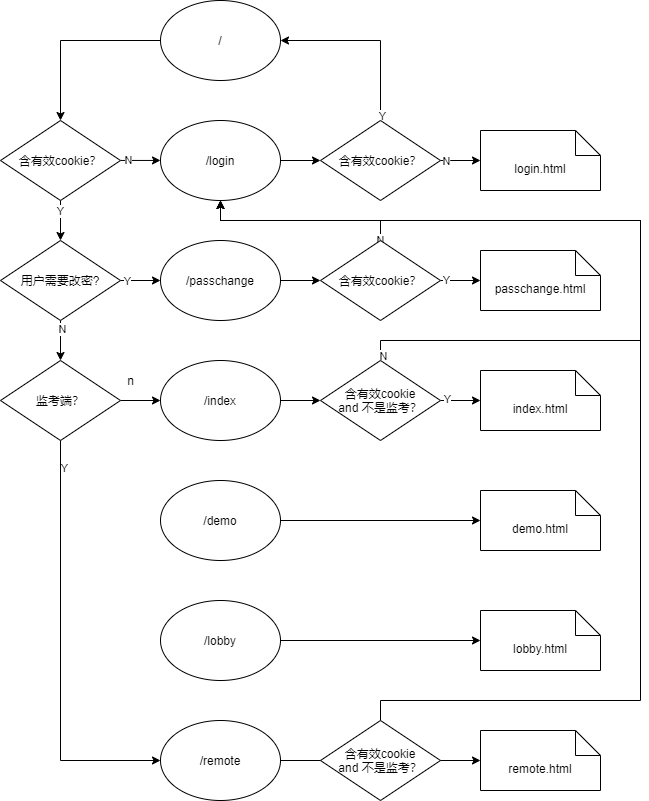

# Remote_recorder
## 简介
基于webrtc的远程记录工具。捕获c端显示器输出与摄像头输入推送至s端；s端记录视频流。

## 实现
下面为项目的实现方案：

### 信令服务
webrtc的信令服务需要自己实现，将采用websocket实现。

对于p2p间的信息交换，采用websocket send的方式。

目前放弃webrtc提供的datachannel，使用websocket通信即可。

因为websocket并不支持自定义事件，所以需要提供一层信息封装，send的message预定义为json格式：
```json
{
    "type": t,
    'data': data
}
```

### sfu结构
考虑到需要在服务端录屏，所以采用sfu结构，如下：


结合具体需求，并不是严格的sfu结构，学生端只有上传流，无下行流，而监考老师端可以无上传流，但必须可以查看某个学生的视频流，为了满足这个要求，需要考虑在查看的某个同学的时候建立`peerConnection`，具体实现，还需细节化。

## 行动
客户端只要1对1，而服务端需要1对many，因此服务端需要在客户端的基础之上进行额外处理，行动吧...

## api

### 登录

- POST
- `/api/login`
- send
	- user: 学号
	- password: 密码
- return
	- res: 0/1/-1 成功/成功，但需要更改密码/失败
	- msg: 提示信息

### 获取当前cookie用户信息

- POST
- `/api/uinfo`
- return
	- res: 0/1/-1 成功/成功，但需要更改密码/失败
	- msg: 提示信息
	- data:
		- no: 账号
		- name: 名字
		- level: 等级
		- enable: 账户可用性。false 表示需要先更换密码。与数据库中的stu_enable无关

### 登出

- POST
- `/api/logout`
- return
	- res: 0/-1 成功/失败
	- msg: 提示信息

### 更改密码

- POST
- `/api/chpw`
- send
	- password: 新密码
- return
	- res: 0/-1 成功/失败
	- msg: 提示信息

### 重置密码，需要重新登录

- POST
- `/api/resetpw`
	- user: 学号
	- password: 新密码
- return
	- res: 0/-1 成功/失败
	- msg: 提示信息

=======================================
新添加内容

### 获取所有参会人员信息
此请求只可以来自监考端，学生端返回失败信息

- POST
- `/api/getmembers`
- return
	- res: 0/-1 成功/失败
	- msg: 提示信息
	- data: [
		{
			- no: 学号
			- name: 姓名
			- stu_level: 0/1 
		},
		...
	]


## 路由

由于改成模板渲染，现在可以设定路由了。

但是，如果前端需要添加新的页面需要新的路由，要手动添加。

好处是，有一些跳转可以有后端参与，用户也不会随便就拿到页面。

现在的路由是这样：




## websocket信令信息约定
下面约定一些websocket的信息，方便通信以及事件处理

### token
第一次连接后发送token

```
action: token
data: token字符串
```

### stream id 
学生端在开启摄像头和共享时的流的id，(2022/6/22日，似乎不需要摄像头流了)

```
学生端发送，服务端存储，一方面用于流录制，另一方面在监考端查看学生时发送
action: streamid
data: {
	screen: id,
	camera: id
}
```

### 事件
下面是部分事件信息：

```
用户加入
action: event
data: {
	event: MemberJoined
	no: 学号
	name: 姓名
}

用户离开
action: event
data: {
	event: MemberLeft
	no: 学号
	name: 姓名
}

监考端查看
首先监考端通过websocket发送数据至服务端

action: event
data: {
	event: GetMemberStream
	no: 需要获取的学生的学号
}

服务端收到后，发送对应学生的流的id，注意：此信息只发送给之前的监考端
action: event
data: {
	event: SendStreamId 
	streamid: {
		screen: id,
		camera: id
	}
}

信息发送完成之后，服务端开始与指定监考端创建peerConnection，并将流转发
createOffer...

```

