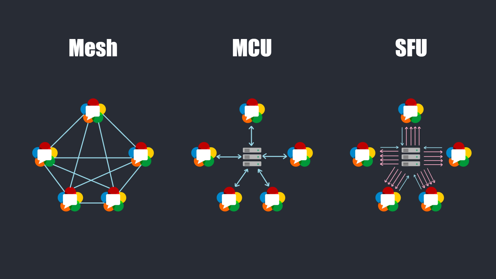

# Remote_recorder
## 简介
基于webrtc的远程记录工具。捕获c端显示器输出与摄像头输入推送至s端；s端记录视频流。

## 实现
下面为项目的实现方案：

### 信令服务
webrtc的信令服务需要自己实现，将采用websocket实现。

对于p2p间的信息交换，采用websocket send的方式。

目前放弃webrtc提供的datachannel，使用websocket通信即可。

因为websocket并不支持自定义事件，所以需要提供一层信息封装，send的message预定义为json格式：
```json
{
    "type": t,
    t: data
}
```

### sfu结构
考虑到需要在服务端录屏，所以采用sfu结构，如下：


结合具体需求，并不是严格的sfu结构，学生端只有上传流，无下行流，而监考老师端可以无上传流，但必须可以查看某个学生的视频流，为了满足这个要求，需要考虑在查看的某个同学的时候建立`peerConnection`，具体实现，还需细节化。

## 行动
客户端只要1对1，而服务端需要1对many，因此服务端需要在客户端的基础之上进行额外处理，行动吧...

## api

```
登录
POST /api/login
send
{
	user: 学号
	password: 密码
}
return
{
	res: 0/1/-1 成功/成功，但需要更改密码/失败
	msg: 提示信息
	token: token
}

登出
POST /api/login
send
{
	user: 学号
	password: 密码
}
return
{
	res: 0/-1 成功/失败
	msg: 提示信息
}

更改密码
POST /api/chpw
send
{
	password: 新密码
}
return
{
	res: 0/-1 成功/失败
	msg: 提示信息
}

重置密码，需要重新登录
POST /api/resetpw
{
	user: 学号
	password: 新密码
}
return
{
	res: 0/-1 成功/失败
	msg: 提示信息
}
```