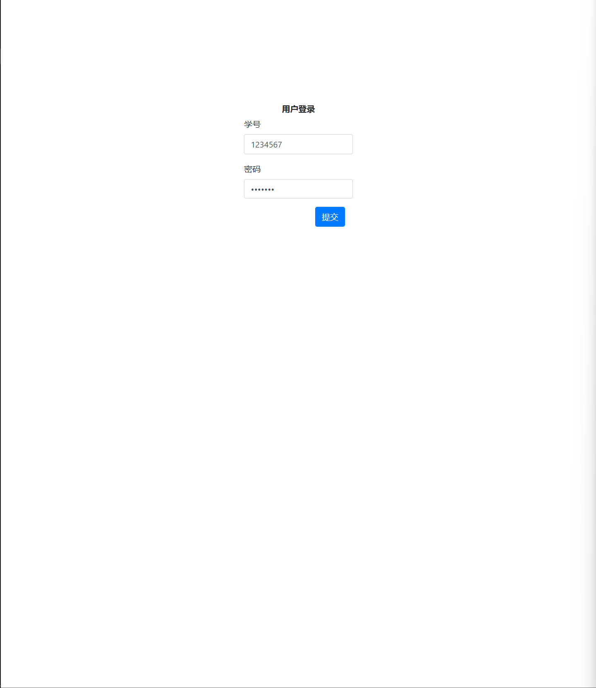
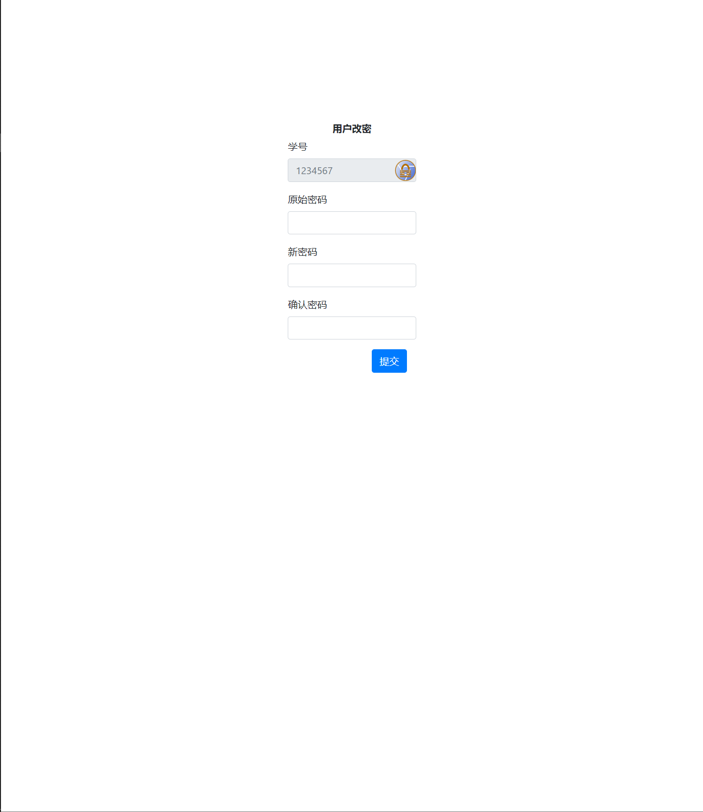
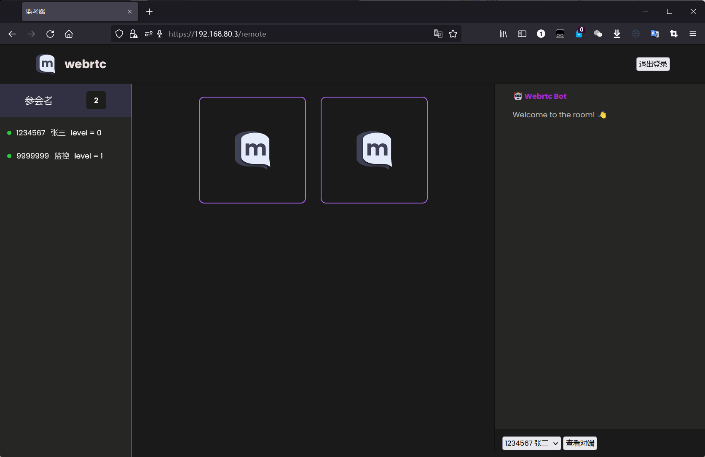

# 使用手册

## 学生端

### 登录



### 改密

用户名与密码相同是认为是第一次登录，需要改密



### 考试界面

点击开始考试系统开始考试。


考试结束退出登录或关闭页面即可。

## 老师端



左侧显示用户列表

右下角切换用户

点击查看对端显示学生屏幕。

## 服务端

服务端配置主要依赖于配置文件

/etc/wrtc-conf.toml

```
# 调试模式
debug = false

#录像保存路径
save_path = "/root"

# 数据库
[database]
#路径
path = "/var/webrtc/webrtc.db3"
# 初始化数据库
initial = true

# 账号
[[database.account]]
no="1234567"
name = "张三"
password = "1234567"
level = "0"
enable = "1"

[[database.account]]
no="9999999"
name = "监控"
password = "9999999"
level = "1"
enable = "1"

# 密码
[password]
# 复杂密码检查
strict_mode = true
#最小长度
length = 8
#最少大写字母
upper = 1
#最少小写字母
lower = 1
#最少数字字符
digital = 1
#最少特殊字符
other = 1

# 应用
[app]
# 端口 http:80 https:443
port = 443
# 启用 https
https = true
# 日志输出位置 debug 模式下无效
log = "/var/log/webrtc.log"
# 资源文件位置
resource = "/var/webrtc/resources"
# 证书文件位置 http 模式下无效
[app.signature]
crt = "/var/webrtc/sign/cert.pem"
key = "/var/webrtc/sign/key.pem"
```

对以上部分词汇做出解释：
调试模式会将日志输出至屏幕，并且有一些额外的信息。
初始化数据库确保程序在打开时会在数据库中建立表。一般在启动之后需要删除，保证信息不遗失。